# 🏗️ Tailscale Deployment Architecture

## System Architecture

```mermaid
graph TB
    subgraph Tailscale["Tailscale Network (Encrypted VPN)"]
        Student[👨‍🎓 Student Device]
        Faculty[👨‍🏫 Faculty Device]
        Admin[👨‍💼 Admin Device]
    end
    
    Student --> TailscaleURL[http://device.tail-scale.ts.net]
    Faculty --> TailscaleURL
    Admin --> TailscaleURL
    
    TailscaleURL --> TailscaleDaemon
    
    subgraph HomeServer["Ubuntu Home Server (Dell Laptop)"]
        TailscaleDaemon[Tailscale Daemon<br/>• Encrypted connections<br/>• Stable hostname<br/>• NAT traversal]
        
        TailscaleDaemon --> DockerStack
        
        subgraph DockerStack["Docker Compose Stack"]
            Nginx[Nginx :80<br/>Reverse Proxy<br/>• Route traffic<br/>• WebSocket support]
            
            Frontend[Frontend :5173<br/>React + Vite<br/>+ Tailwind CSS]
            
            Backend[Backend :3001<br/>Express API<br/>+ Socket.io<br/>+ Drizzle ORM]
            
            Postgres[(PostgreSQL :5432<br/>Database)]
            
            Nginx --> Frontend
            Nginx --> Backend
            Backend --> Postgres
            Frontend -- Socket.io --> Backend
        end
    end
    
    style Tailscale fill:#e1f5fe
    style HomeServer fill:#fff3e0
    style DockerStack fill:#f3e5f5
    style Nginx fill:#c8e6c9
    style Frontend fill:#bbdefb
    style Backend fill:#ffccbc
    style Postgres fill:#f8bbd0
```



## Data Flow

### User Request Flow


### Real-Time Updates (Socket.io)


## Network Topology

### Internal (Docker Network)


### External Access


## File Structure

```
Sports-Week-Management-Tool/
│
├── docker-compose.homeserver.yml    # Docker services configuration
├── nginx.conf                       # Nginx reverse proxy config
├── .env                            # Environment variables (created by script)
│
├── deploy-tailscale.sh             # 🚀 Main deployment script
│
├── TAILSCALE_DEPLOYMENT.md         # Complete deployment guide
├── QUICK_START_TAILSCALE.md        # Quick reference
├── DEPLOYMENT_COMPARISON.md        # Compare deployment options
├── DEPLOYMENT_CHECKLIST.md         # Step-by-step checklist
│
├── backend/
│   ├── Dockerfile
│   ├── src/
│   └── ...
│
└── frontend/
    ├── Dockerfile
    ├── src/
    └── ...
```

## Deployment Process Flow


## Security Layers

```mermaid
graph TD
    Internet[Internet/User Device]
    
    Internet --> Layer1
    
    subgraph Layer1["🔒 Layer 1: Tailscale Encryption"]
        TS[WireGuard Protocol<br/>End-to-end encryption<br/>Device authentication]
    end
    
    Layer1 --> Layer2
    
    subgraph Layer2["🛡️ Layer 2: Firewall UFW"]
        FW[Block all incoming<br/>Allow Tailscale subnet<br/>Allow SSH only]
    end
    
    Layer2 --> Layer3
    
    subgraph Layer3["🐳 Layer 3: Docker Network"]
        DN[Internal network isolation<br/>No direct port exposure<br/>Container-to-container only]
    end
    
    Layer3 --> Layer4
    
    subgraph Layer4["🔐 Layer 4: Application Auth"]
        Auth[JWT tokens<br/>Role-based access<br/>Password hashing bcrypt]
    end
    
    Layer4 --> App[Protected Application]
    
    style Layer1 fill:#e3f2fd
    style Layer2 fill:#f3e5f5
    style Layer3 fill:#e8f5e9
    style Layer4 fill:#fff3e0
    style App fill:#c8e6c9
```



## Traffic Patterns

### User Access Flow


### API Endpoints

**Admin/Manager:**
- Login: `POST /api/auth/login` → Receive JWT token
- Manage Games: `GET/POST/PUT /api/games`
- Update Scores: `PUT /api/matches/:id/score` → Socket.io broadcasts to all clients
- View Reports: `GET /api/points/summary`

**Public/Student:**
- View Dashboard: `GET /`
- View Fixtures: `GET /fixtures`
- View Leaderboard: `GET /leaderboard`
- WebSocket Connection → Receive live updates (score updates, match status, leaderboard changes)

## Scaling Options

### Current Setup (Single Server)

All services on one machine
• Good for: 100-500 concurrent users
• Cost: $0 (home server)
• Maintenance: Manual

### Future Scaling Path


## Monitoring Points


**Key Monitoring Commands:**

```bash
# System Resources
htop                    # CPU/Memory
df -h                   # Disk space

# Docker Stats
docker stats            # Container resources
docker ps               # Container status

# Application Logs
docker compose logs -f backend
docker compose logs -f frontend

# Tailscale Status
tailscale status
tailscale netcheck
```

## Backup Strategy


**Backup Commands:**

```bash
# Daily Database Backup
docker exec sports-week-db pg_dump -U sports_user sports_week > backup_$(date +%Y%m%d).sql

# Weekly Config Backup
tar -czf config_backup_$(date +%Y%m%d).tar.gz .env docker-compose.homeserver.yml nginx.conf

# Restore Database
cat backup_20260209.sql | docker exec -i sports-week-db psql -U sports_user -d sports_week
```

---

## Quick Reference URLs

After deployment, bookmark these:

- **App**: `http://<your-device>.tail-scale.ts.net`
- **Health Check**: `http://<your-device>.tail-scale.ts.net/health`
- **API Health**: `http://<your-device>.tail-scale.ts.net/api/health`
- **Tailscale Admin**: https://login.tailscale.com/admin

## Useful Commands

```bash
# Check everything
./deploy-tailscale.sh

# View logs
docker compose -f docker-compose.homeserver.yml logs -f

# Restart all
docker compose -f docker-compose.homeserver.yml restart

# Stop all
docker compose -f docker-compose.homeserver.yml down

# Check Tailscale
tailscale status

# Enable public access
tailscale funnel 80
```

---

This architecture provides a secure, scalable, and easy-to-maintain deployment for your Sports Week Management Tool!
