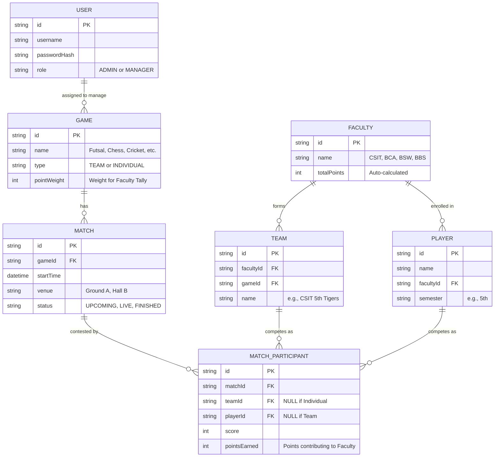

# 🏆College Sports Week Management Tool

**Event:** 3-Day Sports Week  
**Organizer:** CSIT Students
**Faculties:** CSIT, BCA, BSW, BBS  

---

## 📚 Table of Contents
- [Project Overview](#project-overview)
- [Entity Relationship Diagram](#entity-relationship-diagram)
- [Deployment Architecture](#deployment-architecture)
- [Design System & UX/UI](#design-system--uxui)
- [Animation System](#animation-system)
- [Backend & API](#backend--api)
- [Frontend & Testing](#frontend--testing)
- [Docker & Deployment](#docker--deployment)
- [Tailscale Deployment (Recommended)](#tailscale-deployment-recommended)
- [Cloudflare Tunnel Guide](#cloudflare-tunnel-guide)
- [Homeserver Deployment](#homeserver-deployment)
- [Code Architecture & Refactoring](#code-architecture--refactoring)
- [Testing & Reports](#testing--reports)
- [Project Phases & TODOs](#project-phases--todos)
- [Support & Resources](#support--resources)

---

## Project Overview

This tool manages a multi-faculty sports week event, providing real-time dashboards, live scoring, and automated leaderboards. Built with Bun, React, Express, PostgreSQL, Drizzle ORM, and Socket.io.

**Tech Stack:**
- **Runtime:** Bun (v1.0+)
- **Frontend:** React (Vite) + Tailwind CSS v4 + Lucide-React Icons
- **Backend:** Express.js (Bun) + Drizzle ORM
- **Database:** PostgreSQL 16 (Docker)
- **Real-time:** Socket.io 4.8.3
- **Auth:** JWT (Admin/Manager roles)
- **Deployment:** Docker Compose + Tailscale VPN (recommended)
- **Reverse Proxy:** Nginx
- **Container Registry:** GitHub Container Registry (GHCR)

**Deployment Scripts:**
- `deploy-tailscale.sh` - One-command Tailscale deployment
- `build-and-push.sh` - Build and push Docker images to GHCR
- `deploy-homeserver.sh` - Legacy homeserver deployment

**Quick Links:**
- 📐 [Architecture Diagrams](ARCHITECTURE.md) - Mermaid diagrams of deployment architecture
- 🚀 [Tailscale Guide](TAILSCALE_DEPLOYMENT.md) - Recommended deployment method
- 📋 [Quick Start](QUICK_START_TAILSCALE.md) - 5-minute deployment guide
- 📊 [Deployment Comparison](DEPLOYMENT_COMPARISON.md) - Tailscale vs Cloudflare
- ✅ [Deployment Checklist](DEPLOYMENT_CHECKLIST.md) - Step-by-step verification
- 📝 [Deployment Story](linkedin_post.txt) - How this was built and deployed

---

## Entity Relationship Diagram



---

## Deployment Architecture

See [ARCHITECTURE.md](ARCHITECTURE.md) for comprehensive deployment architecture diagrams.

**Interactive Mermaid Diagrams:**
- System Architecture: Complete overview of Tailscale → Docker stack
- Request Flow: Sequence diagram showing user interactions
- Network Topology: Docker network and external access patterns
- Deployment Process: Complete deployment flowchart
- Security Layers: 4-layer security architecture
- Scaling Options: Future growth paths
- Traffic Patterns: User workflow diagrams
- Monitoring Points: Observable metrics
- Backup Strategy: Automated backup schedule

**Key Architecture Highlights:**
- **Tailscale VPN**: WireGuard mesh network for secure access
- **Docker Compose**: 4-container orchestration (nginx, backend, frontend, postgres)
- **Nginx Reverse Proxy**: Routes traffic and handles WebSocket upgrades
- **Zero-Cost Hosting**: Self-hosted on home server (Dell laptop)
- **Real-time Updates**: Socket.io for live score broadcasting

---

## Design System & UX/UI

See [DESIGN_SYSTEM.md](DESIGN_SYSTEM.md) and [UX_BEST_PRACTICES.md](UX_BEST_PRACTICES.md) for full details.

**Highlights:**
- Color system: Blue, green, amber, red, gray palettes
- Typography: System UI, clear hierarchy, accessible sizes
- Spacing: 4px grid, responsive layouts
- Shadows, border radius, and interaction states
- Accessibility: WCAG AA, keyboard navigation, ARIA labels
- Responsive: Mobile-first, breakpoints for all devices

---

## Animation System

See [ANIMATIONS.md](ANIMATIONS.md), [ANIMATION_VISUAL_GUIDE.md](ANIMATION_VISUAL_GUIDE.md), and [ANIMATION_SUMMARY.md](ANIMATION_SUMMARY.md).

**Key Components:**
- PageTransition: Smooth page loads
- CardTransition: Staggered card/grid animations
- StaggerContainer: Coordinated child animations
- ListItemAnimation: List item slide/fade
- ScaleAnimation: Badge pop-in

**Specs:**
- Duration: 200-300ms
- Easing: ease-out, spring (stiffness 300, damping 20)
- Accessibility: Respects prefers-reduced-motion
- GPU-accelerated (transform, opacity)

---

## Backend & API

See [backend/README.md](backend/README.md), [REFACTORING_SUMMARY.md](REFACTORING_SUMMARY.md), and [BACKEND_TEST_REPORT.md](BACKEND_TEST_REPORT.md).

**Features:**
- Express.js backend (Bun runtime)
- Drizzle ORM, PostgreSQL
- JWT authentication (admin/manager)
- Socket.io for real-time updates
- Clean architecture: config, services, routes, middleware
- API endpoints for faculties, games, teams, players, matches, points

**Quick Start:**
```bash
cd backend
bun install
bun run db:push
bun run seed
bun run dev
```

---

## Frontend & Testing

See [frontend/README.md](frontend/README.md), [TESTING.md](frontend/TESTING.md), and [PHASE-9-CHECKLIST.md](PHASE-9-CHECKLIST.md).

**Features:**
- React (Vite), Tailwind CSS, Lucide Icons
- Real-time Socket.io client
- Protected routes (admin/manager)
- Loading skeletons, error boundaries, toast notifications
- Framer Motion animations
- Comprehensive testing with Vitest, Testing Library

**Testing:**
```bash
cd frontend
bun test
```

---

## Docker & Deployment

**Complete Deployment Guides:**
- [TAILSCALE_DEPLOYMENT.md](TAILSCALE_DEPLOYMENT.md) - **Recommended** for home servers
- [DEPLOYMENT_COMPARISON.md](DEPLOYMENT_COMPARISON.md) - Compare Tailscale vs Cloudflare
- [DEPLOYMENT_CHECKLIST.md](DEPLOYMENT_CHECKLIST.md) - Step-by-step verification
- [DEPLOYMENT_SUMMARY.md](DEPLOYMENT_SUMMARY.md) - Quick overview
- [QUICK_START_TAILSCALE.md](QUICK_START_TAILSCALE.md) - 5-minute guide
- [ARCHITECTURE.md](ARCHITECTURE.md) - Architecture diagrams
- [HOMESERVER_DEPLOYMENT.md](HOMESERVER_DEPLOYMENT.md) - Full homeserver guide

**Local Development:**
```bash
docker compose up -d
docker compose ps
docker compose logs -f
```

**Services:**
- Web App: http://localhost:5173
- API: http://localhost:3001
- Database: localhost:5433

---

## Tailscale Deployment (Recommended)

**Why Tailscale?**
- ✅ $0 hosting cost
- ✅ WireGuard encryption (bank-grade security)
- ✅ 5-minute setup
- ✅ No credit card required
- ✅ No port forwarding needed
- ✅ Works behind NAT
- ✅ 100% uptime on private network

**One-Command Deployment:**
```bash
./deploy-tailscale.sh
```

**What it does:**
1. Checks prerequisites (Docker, Tailscale)
2. Gets your Tailscale hostname automatically
3. Generates secure passwords and JWT secret
4. Creates .env with proper configuration
5. Pulls Docker images from GHCR
6. Starts all services with health checks
7. Provides your access URL

**Access URL:**
```
http://<your-device>.tail-scale.ts.net
```

**Build and Push Images:**
```bash
./build-and-push.sh
```

**User Access:**
1. Install Tailscale
2. Join your Tailscale network (via invite link)
3. Access the URL

**See [TAILSCALE_DEPLOYMENT.md](TAILSCALE_DEPLOYMENT.md) for complete guide.**

---

## Cloudflare Tunnel Guide

See [CLOUDFLARE_TUNNEL_SETUP.md](CLOUDFLARE_TUNNEL_SETUP.md) for secure remote access setup.

**Features:**
- Zero open ports on homeserver
- Automatic HTTPS, DDoS protection
- DNS setup, systemd service, troubleshooting

---

## Homeserver Deployment

See [HOMESERVER_DEPLOYMENT.md](HOMESERVER_DEPLOYMENT.md) for full guide.

**Steps:**
1. Install Docker & Compose
2. Clone repo & configure .env
3. Run `docker compose up -d`
4. Monitor with `docker compose logs -f`
5. Backup/restore database as needed

---

## Code Architecture & Refactoring

See [REFACTORING_SUMMARY.md](REFACTORING_SUMMARY.md) and [backend/README.md](backend/README.md).

**Highlights:**
- Clean separation: config, services, routes, middleware
- TypeScript types throughout
- Centralized error handling
- Service layer for business logic
- Real-time events: scoreUpdate, matchStatusChange, leaderboardUpdate

---

## Testing & Reports

See [BACKEND_TEST_REPORT.md](BACKEND_TEST_REPORT.md), [frontend/TESTING.md](frontend/TESTING.md), and [PHASE-9-COMPLETION.md](PHASE-9-COMPLETION.md).

**Backend:**
- All endpoints tested (faculties, games, matches, players, teams, users, points)
- Real-time Socket.io events verified
- Data integrity and performance optimal

**Frontend:**
- Unit/component tests with Vitest
- 80%+ coverage on core components
- Manual and automated test checklists

---

## Project Phases & TODOs

See [AI_CONTEXT.prompt.txt](AI_CONTEXT.prompt.txt) for full breakdown.

**Phases:**
- Phase 0: Infrastructure Setup
- Phase 1: Backend Foundation
- Phase 2: Code Refactoring
- Phase 3: Frontend & Socket.io
- Phase 4: User Management
- Phase 5: Admin CRUD
- Phase 6: Manager Dashboard
- Phase 7: Public Dashboard
- Phase 8: Points Calculation
- Phase 9: UI Polish & Testing
- Phase 10: Deployment

**Current Status:**
- All major features implemented
- Production ready
- See phase checklists for details

---

## Support & Resources

- [Framer Motion Docs](https://www.framer.com/motion/)
- [Web Animation Performance](https://web.dev/animations-guide/)
- [Accessibility & Motion](https://alistapart.com/article/designing-safer-web-animation/)
- [Docker Documentation](https://docs.docker.com/)
- [Bun Documentation](https://bun.sh/docs)
- [Next.js Docs](https://nextjs.org/docs)
- [Prisma Docs](https://www.prisma.io/docs)
- [Supabase Docs](https://supabase.com/docs)

---

**Status:** ✅ Production Ready | 🚀 Self-Hosted on Tailscale  
**Deployment:** ✅ One-command setup (`./deploy-tailscale.sh`) - 5 minutes from zero to deployed  
**Cost:** $0 - Self-hosted on home server (Dell laptop) with Tailscale VPN  
**Access:** Secure mesh network via Tailscale - invite-only access for managers  
**Features:** Real-time scoring, live leaderboards, team management, automated points calculation  

**Recommended Deployment:** Tailscale (see [TAILSCALE_DEPLOYMENT.md](TAILSCALE_DEPLOYMENT.md))  
**Alternative:** Cloudflare Tunnel has free tier limitations - see [DEPLOYMENT_COMPARISON.md](DEPLOYMENT_COMPARISON.md)

**Documentation:**
- Complete architecture diagrams in [ARCHITECTURE.md](ARCHITECTURE.md)
- Deployment guides: Tailscale, Cloudflare, Homeserver
- Production deployment story: [linkedin_post.txt](linkedin_post.txt)

**Last Updated:** February 9, 2026